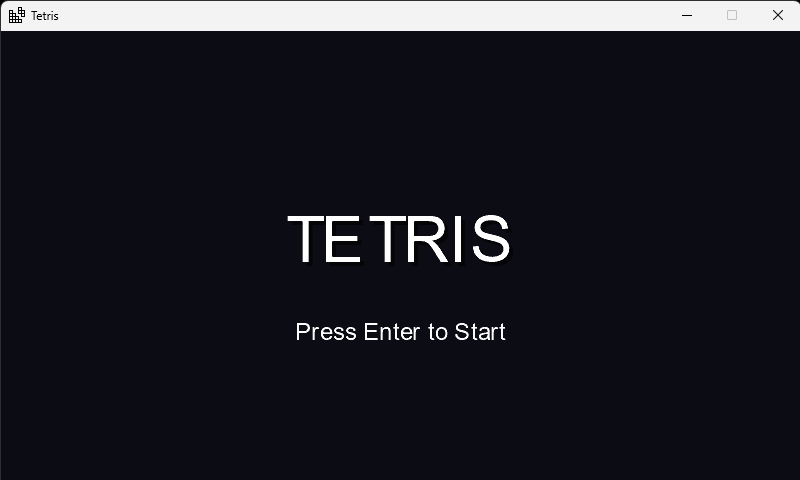
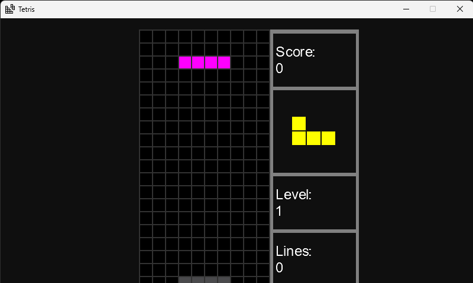

# Tetris 

Juego publicado en: [miguelacs23.itch.io/tetris](https://miguelacs23.itch.io/tetris-monogame-edition)




<video src="https://github.com/user-attachments/assets/e663621d-949a-4a73-a9d1-c7ff49629dab"
width="320" controls muted autoplay loop></video>

## Descripcion:

Juego de Tetris desarrollado con la arquitectura MVC.
Implementando los patrones de diseños:
* Command
* Observer

## Requisitos

- .Net 8
- MonoGame ([documentacion](https://monogame.net))

## Levantar el proyecto:

* Cambiar de directorio
    ``` bash
    cd Tetris
    ```

* Construir el proyecto:
    ``` bash
    dotnet build
    ```

* Levantar el proyecto:
    ``` bash
    dotnet run
    ```

## Controles:

### Para jugar
* ``Up``: Rotar pieza.
* ``Down``: Bajar la pieza una casilla.
* ``Right``: Mover la pieza a la derecha.
* ``Left``: Mover la pieza a la izquierda.

### Acciones
* ``Enter``: Iniciar el juego.
* ``Escape``: Poner pausa el juego.

### En pausa
* ``Enter``: Volver al juego.
* ``Escape``: Salir del juego.

### En GameOver
* ``Enter``: Reiniciar el juego.
* ``Escape``: Salir del juego.
